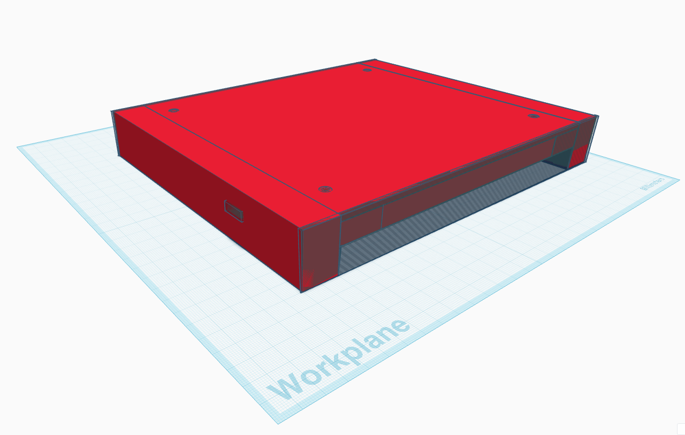
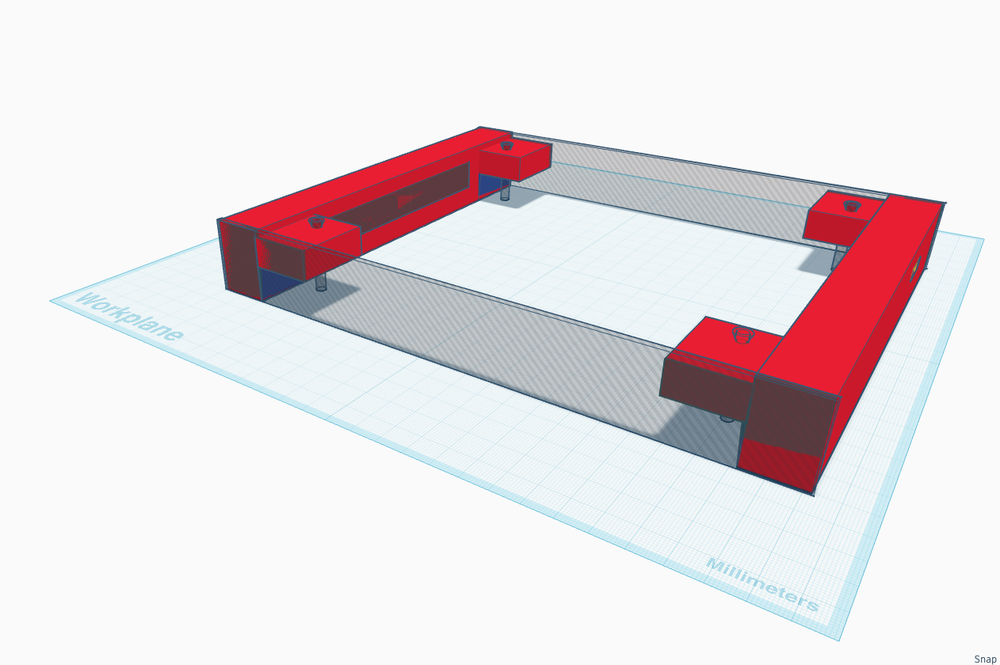
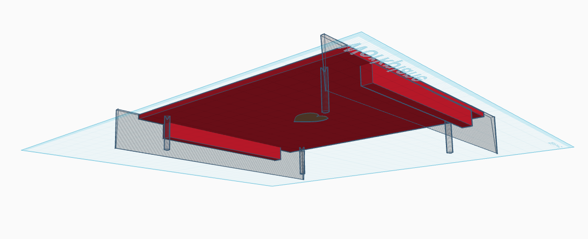

# 🖨️ 3D Printable Enclosure / 3D-Druck Gehäuse

This directory contains the 3D printable enclosure files for the **Adafruit MatrixPortal M4 + 64x64 LED Matrix Display**, created in Tinkercad.

---

## 📸 Component Previews

| Side Panels (Left & Right) | Back Plate (Rückwand) |
| :---: | :---: |
|  |  |

---

## 💾 Downloads & Printable Files

### 🧱 Individual STL Files (Recommended for Slicers)
- 💾 **[Download Left Side Panel STL (MatrixCase_left.stl)](MatrixCase_left.stl)** *(Includes USB port cutout)*
- 💾 **[Download Right Side Panel STL (MatrixCase_right.stl)](MatrixCase_right.stl)**
- 💾 **[Download Back Cover Plate STL (MatrixCase_back.stl)](MatrixCase_back.stl)**

### 📦 Project & Source Models
- 🖨️ **[Download 3MF Project File (MatrixCase.3mf)](MatrixCase.3mf)** *(Bambu Studio / PrusaSlicer / OrcaSlicer project)*
- 🧊 **[Download Tinkercad GLB Model (Matrix Case.glb)](Matrix%20Case.glb)**

---

## 🧩 Components Breakdown

1. **`MatrixCase_left.stl`**: Left side frame with cutout for MatrixPortal M4 USB-C power & programming cable.
2. **`MatrixCase_right.stl`**: Right side frame matching the enclosure geometry.
3. **`MatrixCase_back.stl`**: Rear protective cover plate holding the 64x64 matrix panel securely in place.

---

## 🛠 Printing Recommendations

- **Slicer**: Bambu Studio, PrusaSlicer, OrcaSlicer, or Cura
- **Material**: PLA / PETG / ABS
- **Layer Height**: 0.20 mm
- **Infill**: 15% – 20% (Grid / Gyroid)
- **Supports**: Optional / Minimal
