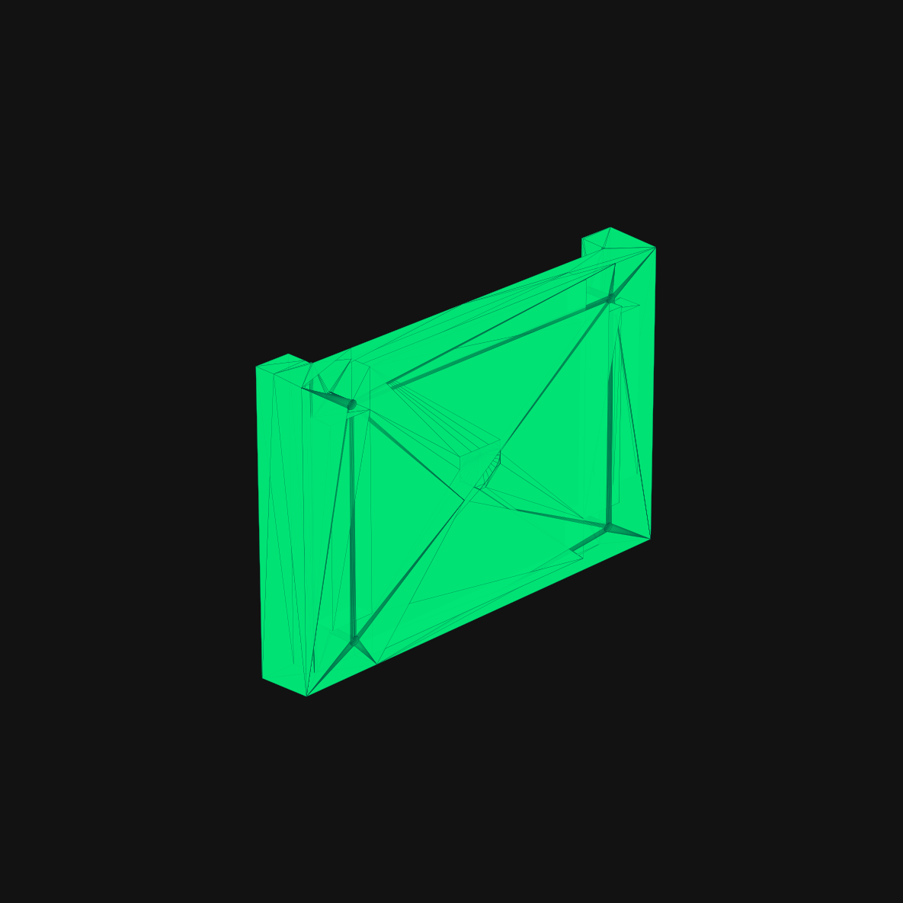

# 🖨️ 3D Printable Enclosure / 3D-Druck Gehäuse

This directory contains the 3D printable enclosure files for the **Adafruit MatrixPortal M4 + 64x64 LED Matrix Display**.

---

## 📦 Downloads & 3D Model Formats

- 💾 **[Download STL File (Matrix_Case.stl)](Matrix_Case.stl)** *(Universal 3D Printing Format)*
- 📦 **[Download Tinkercad GLB Model (Matrix Case.glb)](Matrix%20Case.glb)**

---

## 📐 Components Breakdown (3 Printable Parts):

1. **Left Side Panel (Linkes Seitenteil)**: Side frame with USB cutout for MatrixPortal M4 power & programming access.
2. **Right Side Panel (Rechtes Seitenteil)**: Symmetrical side frame matching the enclosure geometry.
3. **Back Plate (Rückwand-Platte)**: Back cover plate securing the LED matrix panel and electronics.

---

## 🛠 Printing Recommendations

- **Format**: STL (`Matrix_Case.stl`)
- **Material**: PLA / PETG / ABS
- **Layer Height**: 0.2 mm
- **Infill**: 15% – 20%
- **Supports**: Optional depending on printer bridging performance
