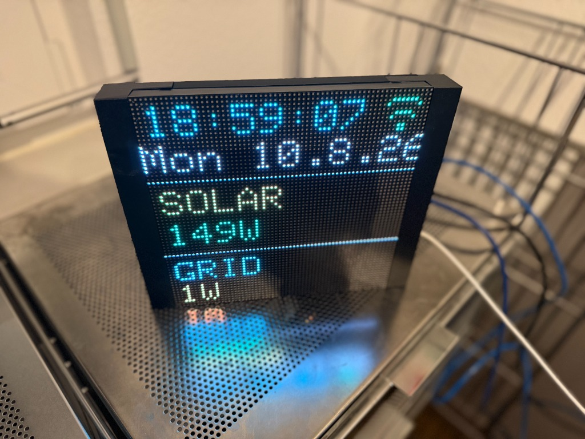

# HomeNodeMatrix ⚡ MatrixPortal M4

**HomeNodeMatrix** is a smart energy and time display built for the **Adafruit MatrixPortal M4** connected to a **64x64 RGB LED Matrix Display**.



It fetches real-time solar generation data from your photovoltaic system (**Fronius Inverter**) as well as grid power consumption/feed-in from your smart meter (**Shelly 3Pro / Pro 3EM**), displaying them alongside synchronized clock and date information.

---

## 💾 Instant Drag-and-Drop Installation (Release Binary)

You can instantly test HomeNodeMatrix without installing Arduino IDE or compiling code:

1. **Download [`HomeNodeMatrix.uf2`](https://github.com/zehrer/HomeNodeMatrix/releases/latest/download/HomeNodeMatrix.uf2)** from the [Latest Release v0.1.0](https://github.com/zehrer/HomeNodeMatrix/releases/latest).
2. Connect your **Adafruit MatrixPortal M4** to your computer via USB.
3. **Double-click the RESET button** on the back of the MatrixPortal M4.
4. The board will appear on your computer as a USB drive named **`MATRIXBOOT`** (or **`PORTALBOOT`**).
5. Drag and drop **`HomeNodeMatrix.uf2`** onto the **`MATRIXBOOT`** drive.
6. The board will automatically flash and reboot! 🎉

---

## 🌟 Features

- **Time & Date Display**: Precise NTP clock synchronization and dynamic weekday calculation (`Mo. 3.8.26` / `Mon 10.8.26`).
- **Solar Generation (`SOLAR`)**: Real-time PV power readings using the **Fronius Solar API v1** (`/solar_api/v1/GetPowerFlowRealtimeData.fcgi`).
- **Grid Power (`NETZ` / `GRID`)**: Live grid import and export readings using the **Shelly Gen2 HTTP API** (`/rpc/Shelly.GetStatus`).
- **Animated Boot Connection Screen**: Clean Wi-Fi icon with a ring of 8 yellow dots filling up clockwise to indicate connection progress (no text).
- **Wi-Fi Access Point & Captive Portal**:
  - Automatically transitions to setup hotspot mode (`HomeNodeMatrix-Setup`) if connection is not established.
  - Displays a random **8-digit PIN** directly on the 64x64 LED matrix.
  - Automatic DNS Captive Portal redirect to `http://192.168.4.1/`.
- **Multi-Language Support**: German (`de`) and English (`en`) selectable via Web UI or Serial CLI.
- **Dark Mode Web Configuration Page**: Easily configure Wi-Fi credentials, IP addresses, API endpoints, language, UTC offset, and display brightness via any web browser.
- **Serial Command Line Interface (CLI)**:
  - Full-featured interactive serial console over USB (compatible with Chrome Web Serial Terminal).
  - Commands: `status`, `debug on/off`, `mode normal/status/dust`, `lang de/en`, `wifi`, `shelly`, `inverter`, `brightness`, `save`, `reset`, `reboot`.
  - Mutable background debug logging (`debug off`) to keep the CLI prompt pristine while typing.
- **On-Board Hardware Button Controls**:
  - **UP Button**: Toggles the **Status Screen** (showing Matrix Portal IP, Shelly IP, and Fronius IP using an ultra-compact 3x5 pixel font).
  - **DOWN Button**: Activates the **PixelDust Sand Physics Demo** (uses the on-board LIS3DH accelerometer for real-time tilt/gravity sand particle simulation).

---

## 📐 3D Printable Enclosure (Tinkercad)

3D printable model files for the custom matrix enclosure are located in the [`3d_models/`](3d_models/) directory.

- **Model File**: [`Matrix Case.glb`](3d_models/Matrix%20Case.glb) (Exported from Tinkercad)
- **Includes 3 Parts**: Left & Right side panels (with USB port cutout) and the protective back plate.

---

## 🛠 Hardware & Requirements

- **Board**: Adafruit MatrixPortal M4 (ATSAMD51 ARM Cortex-M4 + ESP32 AirLift Wi-Fi co-processor)
- **Display**: 64x64 RGB LED Matrix (5 Address Pins)
- **Grid Power Meter**: Shelly 3Pro / Pro 3EM (Default IP: `192.168.178.154`)
- **PV Inverter**: Fronius Symo / Primo / Gen24 with Datamanager 2.0 or Solar API v1 (Default IP: `192.168.178.24`)

---

## 🚀 Building & Flashing from Source

Using `arduino-cli`:

```bash
# Compile
arduino-cli compile --fqbn adafruit:samd:adafruit_matrixportal_m4 .

# Upload directly via USB
arduino-cli upload -p /dev/cu.usbmodem1101 --fqbn adafruit:samd:adafruit_matrixportal_m4 .
```

---

## 💻 Serial CLI Reference

Connect at `115200` baud (e.g. via [Chrome Serial Terminal](https://googlechromelabs.github.io/serial-terminal/)):

| Command | Description |
| :--- | :--- |
| `status` | Display current network status and configuration |
| `lang de` / `lang en` | Switch language between German and English |
| `debug on` / `debug off` | Enable or disable background live debug log output |
| `mode normal` / `status` / `dust` | Switch display mode (Clock/Energy, Status Info, PixelDust) |
| `wifi <ssid> <password>` | Configure Wi-Fi credentials |
| `shelly <ip> [path]` | Configure Shelly 3Pro IP address and API path |
| `inverter <ip> [path]` | Configure Fronius inverter IP address and API path |
| `utc <offset_in_sec>` | Set GMT offset in seconds (e.g. `7200` for CEST) |
| `brightness <10-255>` | Adjust LED matrix brightness (e.g. `brightness 100`) |
| `save` | Persist settings to Flash storage |
| `reset` | Restore default factory settings |
| `reboot` | Perform a hardware reset |

---

## 📜 License

Distributed under the MIT License.
